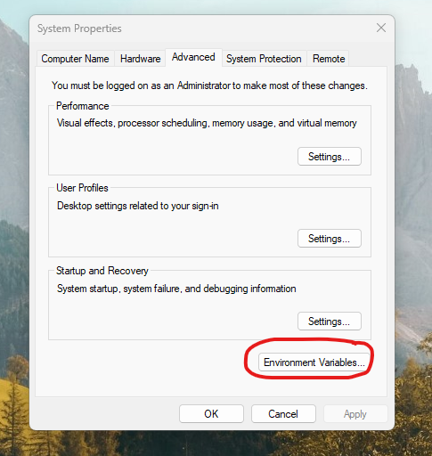
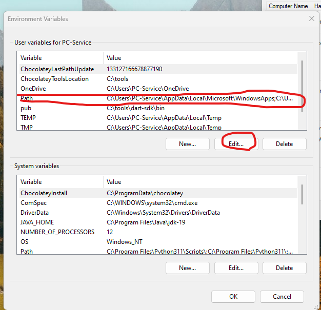
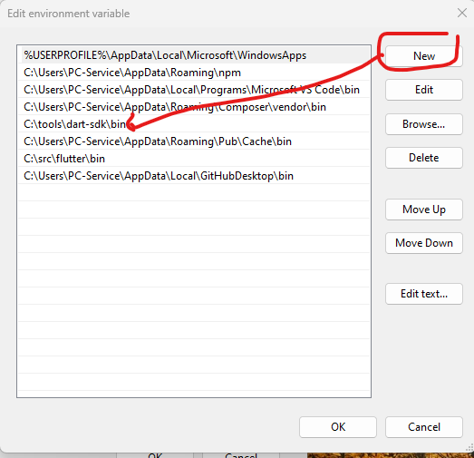
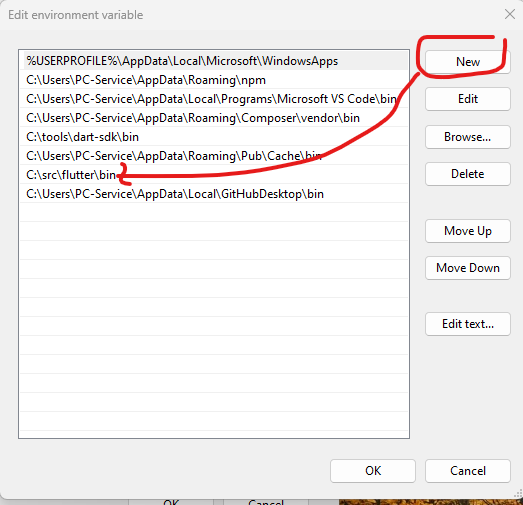

# ---------------- Dart Part ---------------- 

# Installing the Dart SDK  [ dart  instalation doc](https://dart.dev/get-dart#install)


- [downloading the SDK as a zip file](https://dart.dev/get-dart/archive) scroll down to Stable channel section and Choose the version that is compatible with your system

## windows

- go to disc C and unzip the file.

#### add Dart sdk to the PATH environment variable:

* From the Start search bar, enter **env** and select **Edit environment variables** for your account.
* Click Environment Variables….
 


* In the user variable section, select Path and click Edit….
Click New, and enter the path to the dart-sdk directory.




* In each window that you just opened, click Apply or OK to dismiss it and apply the path change.

You have to close and reopen any existing console windows for these changes to take effect.
# ---
## linux

We have two ways to install

###  with a Debian package

Alternatively, download Dart SDK as a [Debian package](https://storage.googleapis.com/dart-archive/channels/stable/release/latest/linux_packages/dart_2.19.2-1_amd64.deb) in the .deb package format.


### or with using apt-get
#### 1) Perform the following **one-time setup**:

```bash
$ sudo apt-get update
$ sudo apt-get install apt-transport-https
$ wget -qO- https://dl-ssl.google.com/linux/linux_signing_key.pub | sudo 
gpg --dearmor -o /usr/share/keyrings/dart.gpg
$ echo 'deb [signed-by=/usr/share/keyrings/dart.gpg arch=amd64] https://storage.googleapis.com/download.dartlang.org/linux/debian stable main' | sudo tee /etc/apt/sources.list.d/dart_stable.list
``` 
#### 2) Then install the Dart SDK:
```bash
$ sudo apt-get update
$ sudo apt-get install dart
```


#### Modify PATH for access to all Dart binaries
After installing the SDK, add its bin directory to your **PATH**
```bash
$ echo 'export PATH="$PATH:/usr/lib/dart/bin"' >> ~/.profile
```


# ---
## mac

#### [Install Homebrew](https://brew.sh/), and then run the following commands:

```bash
$ brew tap dart-lang/dart
$ brew install dart
```

# ---------------- Flutter Part ---------------- 
# install flutter [ Flutter instalation doc](https://docs.flutter.dev/get-started/install)

## 1) Windows  

#### Get the Flutter SDK
- [zip file the latest stable release of the Flutter SDK](https://storage.googleapis.com/flutter_infra_release/releases/stable/windows/flutter_windows_3.7.5-stable.zip)
- Extract the zip file and place the contained flutter in the desired installation location for the Flutter SDK (for example, C:\src\flutter).

or from gihub : 
> C:\src>git clone https://github.com/flutter/flutter.git -b stable

###### add Flutter to the PATH environment variable:

* From the Start search bar, enter **env** and select **Edit environment variables** for your account.
  
* Click Environment Variables….
 
* In the user variable section, select Path and click Edit….
Click New, and enter the path to the dart-sdk directory.




* In each window that you just opened, click Apply or OK to dismiss it and apply the path change.

You have to close and reopen any existing console windows for these changes to take effect.
You have to close and reopen any existing console windows for these changes to take effect.


### Run flutter doctor
From a console window that has the Flutter directory in the path (see above), run the following command to see if there are any platform dependencies you need to complete the setup:

```cmd
C:\src\flutter>flutter doctor
```

#### install 
- [Install Android Studio](https://developer.android.com/studio) 
- vs code

### run flutter app

open project folder 
in console run 
- flutter pub get
- flutter run


## 2) linux
```bash
sudo snap install flutter --classic

flutter doctor

export PATH="$PATH:[PATH_OF_FLUTTER_GIT_DIRECTORY]/bin"

echo $PATH

which flutter

```


## Setup 

- git clone path
- flutter pub get in the project root directory to install all the required dependencies.

## run flutter

```bash
flutter run // after that choose your platform
```